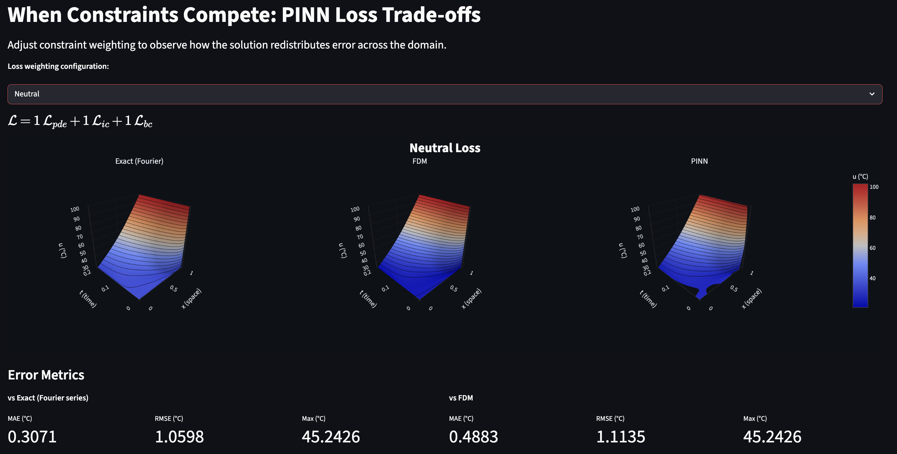

# When Physics Constraints Compete: PINN Behaviour and Trade-offs


PINNs do not satisfy all constraints at once, they balance them.

This project explores how loss weighting in Physics-Informed Neural Networks controls where error ends up. Using the 1D heat equation with a deliberate mismatch between initial and boundary conditions, we compare an exact solution, a finite-difference method (FDM), and a PINN to see how each handles the resulting discontinuity.

The focus is on how the PDE, initial condition, and boundary condition losses compete during training, and how changing their weights alters the learned solution.

An interactive Streamlit app allows you to vary these weights in 4 modes and observe how the model responds.

## App example usage 

<p align="center">
  
</p>

## Physics Scenario

We model a sudden turn-on of heat at the right boundary: the rod starts uniformly at 24°C, while the right end is fixed at 100°C from t = 0. This creates a discontinuity at (x = 1, t = 0).

The discontinuity is not due to a physical defect, but is introduced by the mismatch between initial and boundary conditions at the corner. This is intentional: it provides a controlled test case with a known analytical solution.

This setup allows us to compare how different methods handle sharp jumps and related effects (e.g. Gibbs oscillations in the Fourier solution), and to observe whether PINNs smooth out or capture the discontinuity.

## Heat Equation

The PDE studied in this repository is the **1D heat equation**:

$$
\frac{\partial u}{\partial t} = \alpha \frac{\partial^2 u}{\partial x^2}
$$

Boundary and initial conditions are chosen so that an **analytical solution exists**, enabling direct comparison between:

- **Exact solution** (derived analytically with boundary condition constraints)  
- **Finite Difference Method (FDM)** (central differencing scheme)  
- **Physics-Informed Neural Networks (PINNs)** (hybrid supervised + PDE-constrained learning)  

## How to Run

```bash
git clone https://github.com/yourrepo
cd yourrepo
pip install -r requirements.txt
streamlit run app.py
```

## Error metrics 

MAE (Mean Absolute Error)
Average over the space–time grid of the absolute temperature difference between the predicted and reference solution (in °C). A single “typical” error size; robust to a few large outliers.

RMSE (Root Mean Square Error)
Square root of the average of the squared temperature differences (in °C). Same units as MAE but penalizes large local errors more, so it’s more sensitive to spikes (e.g. near the discontinuity).

Max (Maximum Absolute Error)
Largest absolute temperature difference at any point on the grid (in °C). Highlights the worst local error (e.g. at the boundary or near the discontinuity).

## Discussion and Results

<div align="center">
| Setup      | Comparison | MAE   | RMSE  | Max Error |
|:------------:|:-----------:|:-------:|:-------:|:-----------:|
| Neutral    | vs Exact  | 0.3071 | 1.0598 | 45.2426 |
|            | vs FDM    | 0.4883 | 1.1135 | 45.2426 |
| BC Heavy   | vs Exact  | 0.2805 | 1.2177 | 69.4912 |
|            | vs FDM    | 0.2771 | 1.1449 | 55.1377 |
| IC Heavy   | vs Exact  | 1.0258 | 1.7776 | 64.5622 |
|            | vs FDM    | 1.2134 | 1.9072 | 64.5622 |
| PDE Heavy  | vs Exact  | 0.7928 | 1.9085 | 43.3580 |
|            | vs FDM    | 0.9622 | 1.9891 | 41.8192 |
</div>

The results show a clear trade-off across different loss weightings. The neutral configuration provides the most balanced performance, achieving the lowest RMSE against the exact solution while maintaining moderate errors overall, suggesting it offers the best compromise when no constraint is prioritised. Increasing the boundary condition weight reduces average error (MAE), particularly against FDM, indicating better enforcement at the boundary. However, this leads to a significant increase in maximum error, meaning inaccuracies are pushed into the interior. In contrast, the IC-heavy case performs worst overall, with the highest MAE and RMSE, showing that overfitting the initial condition causes the solution to degrade over time. The PDE-heavy setup reduces maximum error, suggesting better satisfaction of the governing equation in the interior, but at the expense of higher overall error, likely due to weaker enforcement of boundary and initial conditions. Across all configurations, large maximum errors persist, highlighting that the discontinuity remains the dominant source of error. Overall, the results demonstrate that loss weighting does not eliminate error, but instead redistributes it depending on which constraints are prioritised.

Graphically this is also clear. In the IC heavy case, the solution curve cuts through the domain and clearly disobeys the boundary condition. The neutral and PDE heavy cases try to handle the discontinuity more smoothly, but still struggle near the corner. The BC heavy case also shows a curved behaviour that violates the initial condition at the corner where u(0,0) should be 24. There is also a consistent tendency to overestimate heat, which appears in both the FDM and PINN solutions when compared to the exact solution.

The main takeaway is that the model is not really reducing error, it is deciding where to put it depending on how the loss is weighted.

Experimental/Dev notes are located at src/log.md 

Completion on 18/3/26